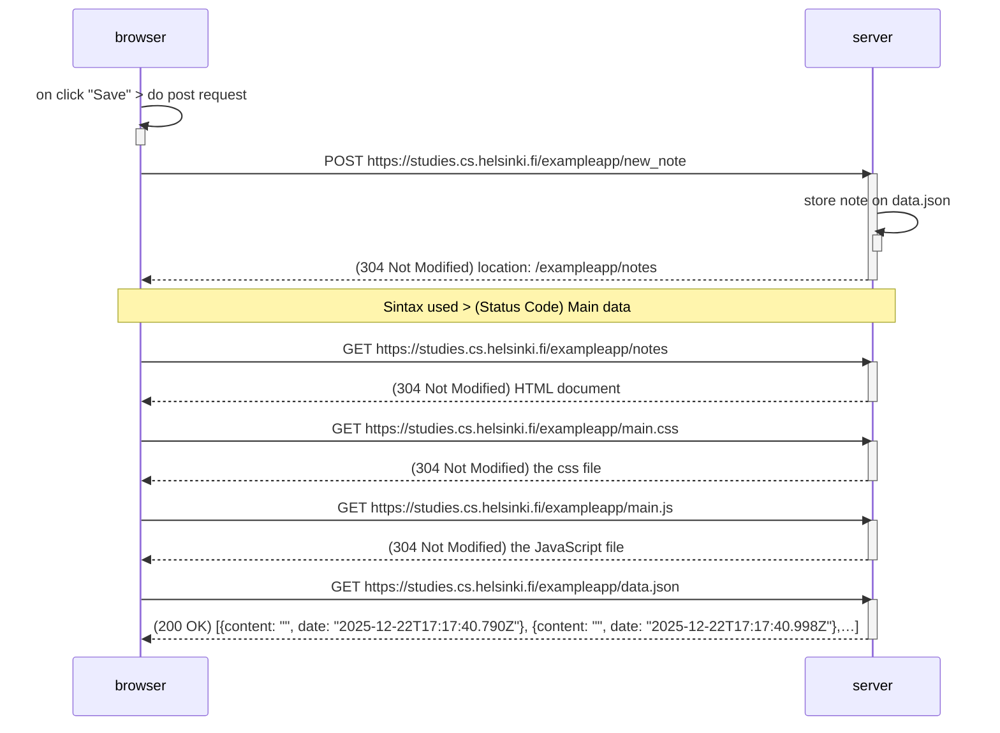

```mermaid
sequenceDiagram
    participant browser
    participant server

    browser->>browser: on click "Save" > do post request   
    activate browser
    deactivate browser

    browser->>server: POST https://studies.cs.helsinki.fi/exampleapp/new_note
    activate server

    server->>server: store note on  data.json
    activate server
    deactivate server

    server-->>browser: (304 Not Modified) location: /exampleapp/notes
    deactivate server
    Note over server,browser: Sintax used > (Status Code) Main data


    browser->>server: GET https://studies.cs.helsinki.fi/exampleapp/notes
    activate server
    server-->>browser: (304 Not Modified) HTML document
    deactivate server

    browser->>server: GET https://studies.cs.helsinki.fi/exampleapp/main.css
    activate server
    server-->>browser: (304 Not Modified) the css file
    deactivate server

    browser->>server: GET https://studies.cs.helsinki.fi/exampleapp/main.js
    activate server
    server-->>browser: (304 Not Modified) the JavaScript file
    deactivate server

    browser->>server: GET https://studies.cs.helsinki.fi/exampleapp/data.json
    activate server
    server-->>browser: (200 OK) [{content: "", date: "2025-12-22T17:17:40.790Z"}, {content: "", date: "2025-12-22T17:17:40.998Z"},…]
    deactivate server

```