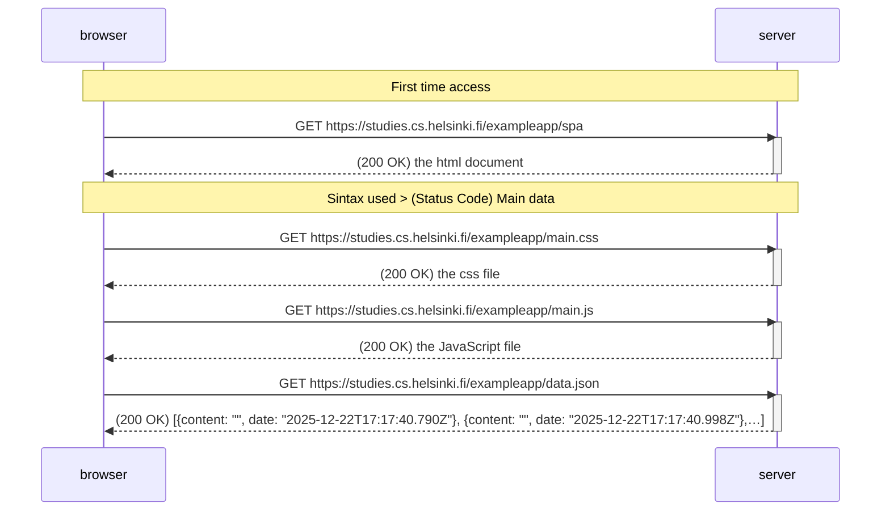

```mermaid
sequenceDiagram
    participant browser
    participant server

    Note over server,browser: First time access
    browser->>server: GET https://studies.cs.helsinki.fi/exampleapp/spa
    activate server
    server-->>browser: (200 OK) the html document
    deactivate server
    
    Note over server,browser: Sintax used > (Status Code) Main data


    browser->>server: GET https://studies.cs.helsinki.fi/exampleapp/main.css
    activate server
    server-->>browser: (200 OK) the css file
    deactivate server

    browser->>server: GET https://studies.cs.helsinki.fi/exampleapp/main.js
    activate server
    server-->>browser: (200 OK) the JavaScript file
    deactivate server

    browser->>server: GET https://studies.cs.helsinki.fi/exampleapp/data.json
    activate server
    server-->>browser: (200 OK) [{content: "", date: "2025-12-22T17:17:40.790Z"}, {content: "", date: "2025-12-22T17:17:40.998Z"},…]
    deactivate server
```